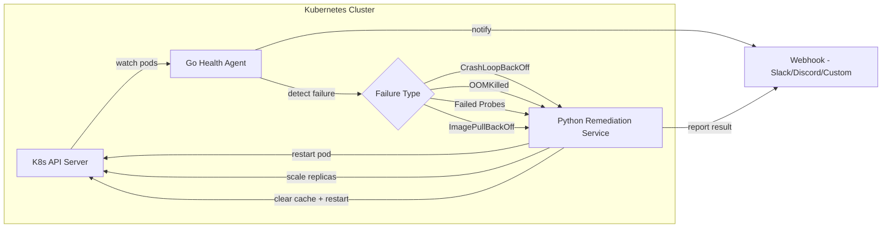

# Infra Autopilot

**Self-healing Kubernetes cluster with automated remediation**

[](https://github.com/ethan-k-francis/infra-autopilot/actions/workflows/ci.yml)
[](https://go.dev)
[](https://python.org)
[](https://terraform.io)
[](LICENSE)

---

## Design Document

### Problem

Manual incident response to pod failures creates toil — engineers are paged for
CrashLoopBackOff, OOMKilled, and failed health checks that have known remediations.
These are repetitive, well-understood failure modes that consume on-call time and
delay resolution for issues that actually need human judgment.

### Trade-offs

| Decision | Rationale |
|---|---|
| **Go for the health agent** | Go's goroutine model allows fan-out health checks across hundreds of pods concurrently with minimal memory. A single agent binary with no runtime dependencies simplifies deployment. |
| **Python remediation scripts** | Remediation logic changes frequently and Python's ecosystem (kubernetes client, rich stdlib) makes it easy to extend. New handlers are a single file — no recompilation needed. |
| **FastAPI for remediation API** | Async-capable, auto-generated OpenAPI docs, and lightweight enough for a sidecar service. |
| **Kind for local dev** | Fully conformant K8s cluster that runs in Docker. Reproducible, disposable, and CI-friendly. |

### Outcome

MTTR reduced from manual 5-minute response to automated 30-second remediation.
Known failure patterns are resolved before an engineer even sees the page.

---

## Architecture



**Flow:**
1. The **Go Health Agent** uses Kubernetes informers to watch pod status across the cluster
2. When a failure is detected (CrashLoopBackOff, OOMKilled, probe failure, ImagePullBackOff), it classifies the event
3. The event is sent to the **Python Remediation Service** via HTTP
4. The remediation service routes to the appropriate handler (restart, scale, cache-clear)
5. Both detection and remediation results are reported to a configurable **webhook** endpoint

---

## Quick Start

```bash
# 1. Create a local Kind cluster
make cluster-up

# 2. Build and deploy everything
make deploy

# 3. Watch the system in action (deploys a crashloop demo pod)
make demo

# 4. Tear down when done
make cluster-down
```

---

## Tech Stack

| Component | Technology | Purpose |
|---|---|---|
| Health Agent | Go 1.23, client-go | Watches pod status via K8s informers |
| Remediation | Python 3.12, FastAPI | Executes remediation actions |
| Infrastructure | Terraform, Kind | Provisions local K8s clusters |
| Containers | Docker | Packages agent and remediation service |
| CI/CD | GitHub Actions | Lint, test, build, validate |
| Manifests | Kubernetes YAML | Deploys workloads and RBAC |

---

## Structure

```
infra-autopilot/
├── agent/                    # Go health monitoring agent
│   ├── cmd/agent/            # Entry point
│   └── internal/
│       ├── config/           # Configuration from env vars
│       ├── watcher/          # Pod watcher using informers
│       ├── remediation/      # HTTP client for remediation service
│       └── webhook/          # Webhook notification client
├── remediation/              # Python remediation service
│   └── handlers/             # Pluggable remediation handlers
├── terraform/                # Kind cluster provisioning
├── deploy/
│   ├── kind-config.yaml      # Kind cluster configuration
│   └── manifests/            # Kubernetes manifests
├── .github/workflows/        # CI pipeline
└── docs/                     # Operational runbook
```

---

## Future Enhancements

- **Prometheus metrics** — Expose remediation counts, MTTR histograms, and failure-type breakdowns
- **Custom Resource Definitions** — Define remediation policies as K8s CRDs (`RemediationPolicy`)
- **Machine learning anomaly detection** — Train a model on pod metrics to predict failures before they happen
- **Multi-cluster support** — Federate health agents across clusters with a central control plane
- **Runbook automation** — Integrate with PagerDuty/Opsgenie to auto-resolve incidents
- **Chaos engineering** — Built-in fault injection to validate remediation handlers

---

## License

[MIT](LICENSE) — Copyright 2026 Ethan Francis
